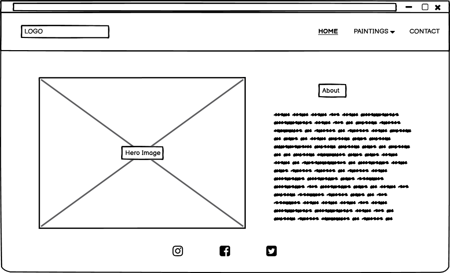
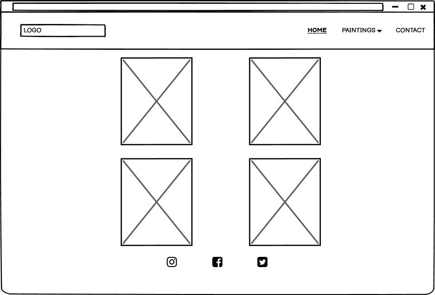
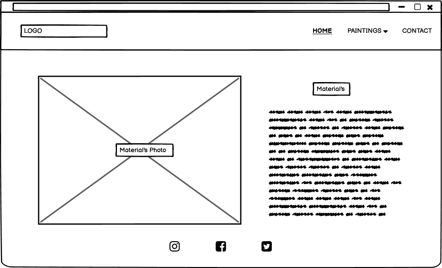
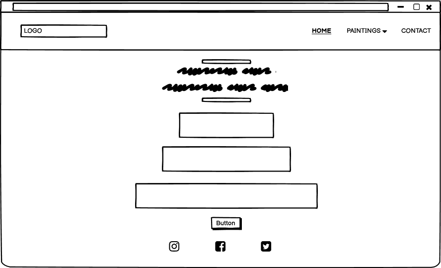

  

# Description 
- This website is constructed to display the artists' crafted landscape artwork in a compelling, yet simple and intriguing way. In the digital age, a website can be seen as a diverse storefront to which the traditional brick and mortar can not compare. As technology is granting simple access for companies to reach new clientele in distant places, the purpose for the creation of this website is to broaden the artists' clientele and create a platform to ensure a quicker buying process and enable a fellow artist to contact the client for any queries such as collaborations. 

# UX
- This website is to showcase an artist's work and to build a network amongst fellow artists to collaborate. Client's main object is simplicity, therefore, there have been various elements included; such as navigation bar to navigate the user to the right place and paintings to show the work done by the artist so far. I have also included content for the users to gain information about the artist and footer containing social media links to gain further knowledge about the artist's work. 
### **Home Page:**
- The home page design is very simple keeping the artist's painting photo to the left of the screen whilst moving the information about the artist to the right of the screen. Navigation bar at the top has been kept the same through out all the pages. Footer at the bootm of the page has been kept the same to keep consistency. 
### **Paintings Page:**
- The Paintings page has been kept simple for artist's art only. This page contains 6 Paintings to show the work done by the artist so far. Every painting has been added with popup messeage during mouse hover to show the description of the painting.
### **Material Page:**
- This page has been added under the painting dropdown as it shows what material has been used for the art. To keep the consistency through out all the pages this page has been kept very simple as well. 
### **Contact Page:**
- The Contact page has been added so that users can intract with the Artist to get more information about the paintings or any other queries. In order to get in touch with the Artist, a form has been added to submit any messages or queries with there contact details. 

# Wireframe
- Wireframes were made at the beginning of this project in order to design the website as per artist's request. These wireframes were styled using Balsamiq software. 

### **Wireframe Screenshots:**

  

  

  

  

#  Visual Identity
- Initially, I used LogoMakr to make a simple but descriptive Logo. 
Speaking to the artist herself, I gathered all the information and preferences on how simple and detailed the website needs to be. 
I have kept the colours and content very minimal for this website, so the paintings do not fade away in the process and get as much recognition as possible.
The style has been kept the same throughout the website to maintain consistency and simplicity. Therefore, Header and Footer have been used repeatedly throughout all the pages. 
Home page contains the main image of the artist's work, including information section on the right; maintaining the consistency, the material page has been kept the same with additional equipment images and information containing material used. 
The Paintings page consist of no content other than the images and hover over effect to name the paintings. This page has been kept simple so the users would be only using the page for its given purpose. 
The Contact page was designed using bootstrap and was kept very clean with a message at the top of the form for the users.

# Site Overview

#  User Stories
### **User:**
- As a user, I would like know business owners persoanlity and specialities in the world of Art. 
- As a user, I would like to see the work done so far by the Artists involved in this business. 
- As a user, I would like an understanding on what materials could be used in Art Process.
- As a user, I would like to collaborate on a Art Work with the owner or Artist's involved in this business.

### **Artist:**
- As an Artist, I would like would like the user to get to know me and to know what king od paintings my interests lie towards. 
- As an Artist, I would like the user to be able to view the work I have done so far.  
- As an Artist, I would like to give an insight into my painting process by detailing the equipment I use. 
- As an Artist, I would like to collaborate with fellow Artists on Art peices therefore would like the users to get in touch if interested. 

### **Actions taken to accomplish these goals are:**
- In order for the users to get to know the Artist, there has been about section added with infromation about the Artist. 
- In order for the user to view Artist's word done so far, I have added Paintings page with all the images on it. 
- In order for the user to get information about the material used for most of the paintings done by the artist, I have added materials page with all the information on it. 
- In order for the user to get in touch with the artist, I have added contact page with submit form so the Artist can get in touch with the user. |

#  Testing

# Deployment

# Code Validation

# Technologies
I have used several useful resources in order to make this website, such as:
- [HTML5](https://en.wikipedia.org/wiki/HTML5) was used for the code for content of this website.

- [CSS3](https://en.wikipedia.org/wiki/CSS) was used for to style the content of this website as per requested by the Artist. 

- [Bootstrap4](https://getbootstrap.com/) was one of the most used technologies through out the website to make it user friendly. Boostrap was used for used to make the navigation bar for the website including the dropdown menu,columns for the main content for the pages.

- [Balsamiq](https://balsamiq.com/)was used to create the wireframes to initiat the design for this website. 

- [Logo Makr](https://logomakr.com/)  was used to make the Logo for the website.

- [Google Font](https://fonts.google.com/)  was used all through the website for font.

- [Font Awesome](https://fontawesome.com/) was used for the icons used for the website; such as social media icons in the footer section. 

# Acknowledgement
I would like to thank code isntute to start with for all the help and support provided through the modules and introducing myself to mentor Felipe, who has been a great help through out the journey so far. 
I would also like to mention Slack and Tutors who are always willing to help as and when needed.
Also, technologies I have come across in this process such as bootstrap, font awsome, google fonts and etc. All these have been a great help at every step of the journey so far. 

